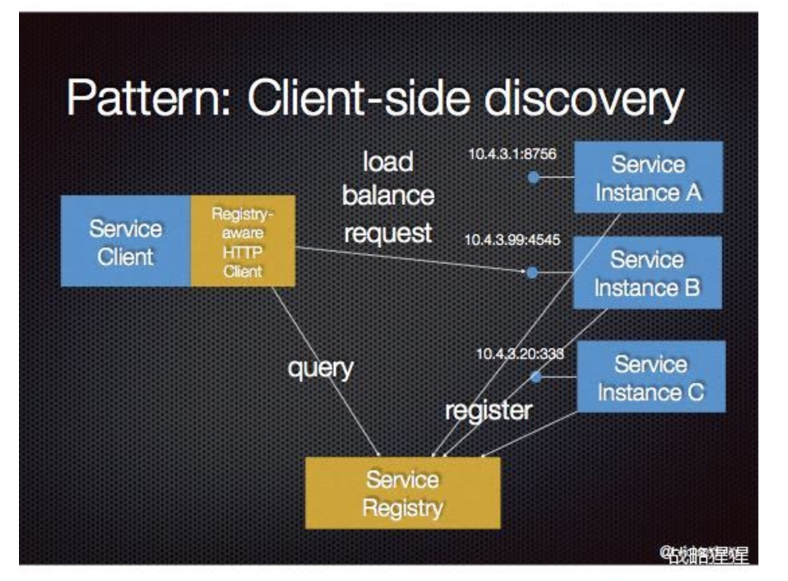
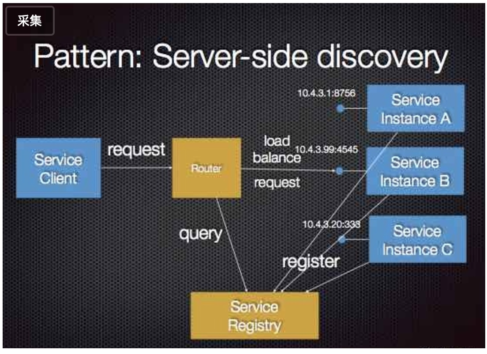
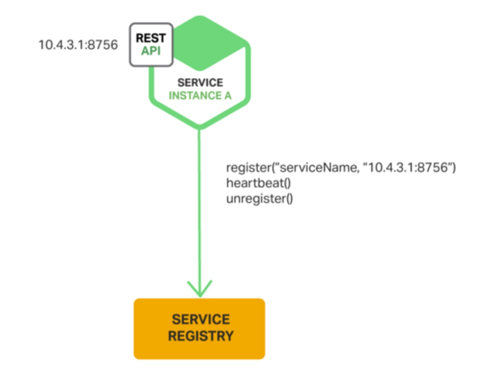
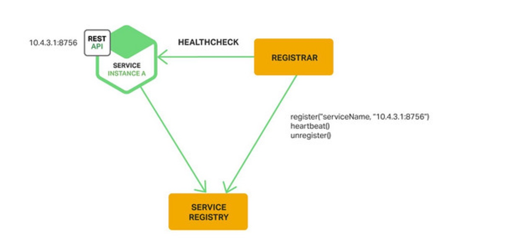

# 服务发现和服务注册

## 概念
- 服务注册：服务实例启动时注册到服务注册表中。
- 服务发现：当服务注册表中注册新的服务实例时能够通知其他的服务，让其他服务知道新的服务已经启动了。

## 服务发现
包括下面两种服务发现：

- 客户端服务发现：客户端向服务注册表发送一个请求查询注册列表，然后客户端使用一个负载均衡算法去选择一个服务实例进行访问。

- 服务端服务发现：客户端通过负载均衡器向一个服务发送请求，负载均衡器查询服务注册表，并将请求路由到可用的服务实例上。

## 服务注册
包括两种服务注册方式：

- 服务自注册：服务实例启动时注册到服务注册表中，一段时间后服务实例发送心跳请求防止注册过期，当出现注册过期时从服务注册表中注销服务实例.

- 第三方注册：服务实例不会自己在服务注册表中注册，由另一个系统组件service registrar负责,service registrar通过轮询部署环境或订阅事件去跟踪运行中的实例的变化。当它注意到一个新的可用的服务实例时，就会到注册表中去注册。service registrar也会将停止的服务实例注销。开源项目如：Registrator

## 参考
- [客户端服务发现](http://blog.csdn.net/xn_sung/article/details/52336732)
- [服务端服务发现](http://www.primeton.com/read.php?id=2269&his=1)
- [服务发现与服务注册](http://www.cfanz.cn/index.php?c=article&a=read&id=306176)

